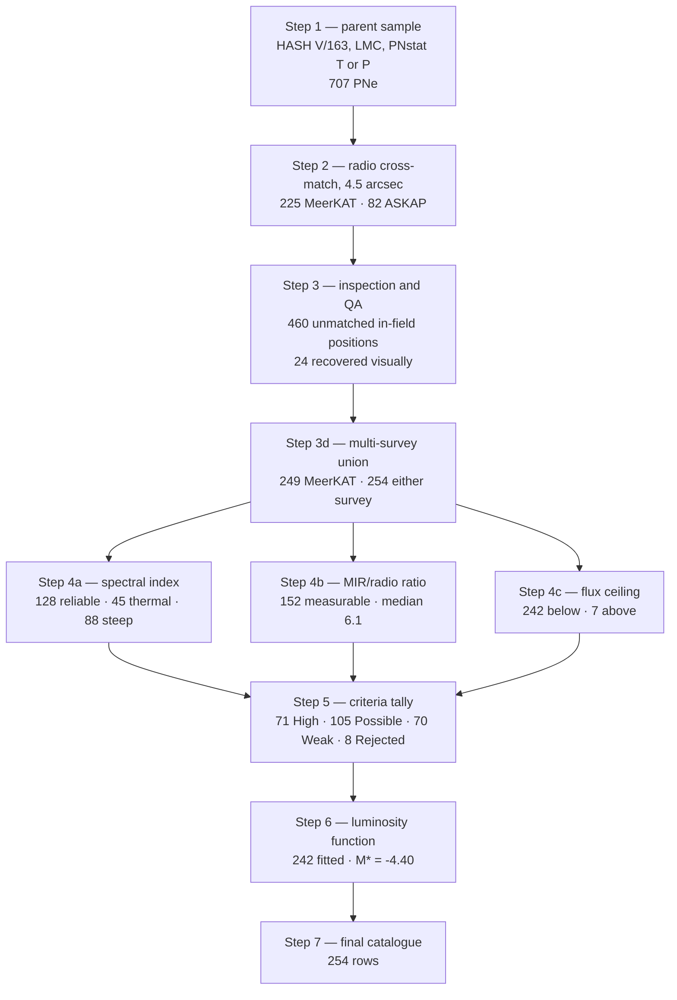

# Method

Last updated: 30 August 2026.

Numbers in this document are the ones the pipeline currently produces. If you
change the code they will move; re-run `scripts/run_pipeline.py` rather than
trusting this file.

## Workflow

## Step 1 — parent sample

Every HASH V/163 entry with `Domain == LMC` and `PNstat` in `{T, P}`: 545 true
and 162 probable, 707 in total. A further 138 LMC entries are classified as
something else (star clusters, SNRs, H II regions) and are set aside.

The sample is taken from HASH rather than assembled by hand so that it can be
reproduced exactly from a public database. Reid & Parker (2006, 2014) is
cross-matched in afterwards, but only to carry columns HASH does not hold: the
RP number, the optical class, and the 8 um photometry. 605 of the 707 carry an
RP identifier; 265 carry 8 um photometry.

## Step 2 — radio cross-match

Optical positions are matched against the MeerKAT 1.295 GHz catalogue and the
published ASKAP-EMU 888 MHz list within **4.5 arcsec** — three MeerKAT pixels,
about half the synthesised beam. This yields 225 MeerKAT and 82 ASKAP
counterparts.

The offsets are centred on zero with a median separation of 0.76 arcsec. ASKAP
shows a small systematic shift in right ascension (-0.82 arcsec against -0.14
for MeerKAT), consistent with its coarser beam. At the ASKAP surface density,
1.6 accidental matches would be expected across the whole parent sample.

## Step 3 — inspection and quality assurance

A source finder works to a fixed threshold, so a real but faint nebula never
enters the catalogue at all. Of the 482 parent PNe left unmatched by Step 2,
460 lie inside the MeerKAT mosaic and 22 outside it. Each of the 460 is
inspected on the image and aperture photometry is extracted where emission is
present at the optical position.

24 nebulae are recovered this way, with a median integrated flux density of
0.020 mJy and a median peak SNR of 4.1. These are the least secure detections
in the sample and sit almost entirely in the faintest luminosity bins.

`step3b2_reextract_visual.py` applies the aperture correction. It is a separate
numbered step because it must run: without it the visual fluxes are low by a
factor of two, and `step3d` raises rather than silently falling back to the
uncorrected values.

The MeerKAT total is then 249. Combining with ASKAP: 77 detected by both, 172
by MeerKAT alone, 5 by ASKAP alone — **254 detected by either survey**.

## Step 4 — three independent criteria

None of the three uses the optical classification. Each returns pass, fail, or
*nothing to say*, and the third answer is not a failure.

### 4a — in-band spectral index

`log S = alpha log nu + c` by weighted least squares over up to twelve MeerKAT
sub-bands (908-1656 MHz; channels 8 and 9 dropped for RFI) together with the
ASKAP 888 MHz point where available. The ASKAP point nearly doubles the
frequency lever arm, which is why the fit is done here rather than taken from
the catalogue column.

An index is used only if `n_pts >= 4`, `alpha_err < 0.5` and `chi2_nu < 10`.
128 of the 254 survive: 45 thermal (`-0.2 <= alpha <= +2.0`), 35 uncertain, 88
steep (`alpha < -0.5`).

The steep fraction is **not** a contamination rate. Compared bin by bin against
the general MeerKAT field, the median index of these PNe exceeds the field by
only +0.11 below 0.3 mJy, but by +0.95 above 1 mJy. The criterion separates the
two populations only at the bright end, and most detections are fainter than
that.

### 4b — mid-infrared to radio ratio

`F_8um[Jy] = 64.13 * 10^(-m/2.5)`, divided by the radio flux. The ratio is
computed at the frequencies actually measured rather than scaled to a common
one: ASKAP 888 MHz where it exists, otherwise MeerKAT 1.295 GHz. 888 MHz is
preferred because it lies closer to the effective frequency of the Galactic
calibration.

152 sources have both measurements; the median ratio is 6.1 against the
Galactic 4.7 (Cohen et al. 2011).

**This criterion does not behave as intended in this sample.** Split by
spectral class, thermal sources have a median ratio of 23.3 — which the Cohen
screen calls H II-like — while steep sources have a median of 2.7, inside the
PN band. The screen places the likely background galaxies inside the PN box and
the likely PNe outside it. The agreement of the overall median with the
Galactic value is a coincidence of mixing two populations that sit an order of
magnitude apart. The Magellanic calibration is known to be higher (9 +/- 2,
Filipovic et al. 2009; 11.9, Leverenz et al. 2017). We report this rather than
tune the screen, and a dedicated Magellanic recalibration is needed.

### 4c — radio flux ceiling

Placing NGC 7027 (1.543 Jy at 0.98 kpc) at the LMC distance of 49.59 kpc gives
0.60 mJy. Filipovic et al. (2009) adopt 2.2 mJy as a working ceiling for the
Magellanic Clouds, allowing for objects somewhat more luminous and for the
scaling uncertainty; that value is used here. PNe are optically thin and nearly
flat-spectrum at these frequencies, so a limit derived at 4.8 GHz carries to
1.295 GHz essentially unchanged.

242 detections fall below the ceiling, 7 above it. Six of the seven are
optically classified only as probable PNe.

## Step 5 — scoring the criteria

Each detection is scored **out of the criteria that could be evaluated for it**,
not out of a fixed three. An object with no 8 um photometry and a spectrum too
faint to fit is not a weaker candidate than one with three measurements; it is
an object we know less about, and scoring it out of three would penalise it for
the state of the ancillary data.

| Class | Rule |
|---|---|
| `Radio_Rejected` | fails a hard physical test: above the ceiling, or radio position more than 4.5 arcsec from the optical |
| `Radio_High` | every measurable criterion passed, at least two measurable |
| `Radio_Possible` | more than half of the measurable criteria passed |
| `Radio_Weak` | half or fewer passed |

Result: **71 High, 105 Possible, 70 Weak, 8 Rejected**. Seven of the eight
rejections are the over-ceiling objects; the eighth is a sub-threshold recovery
whose radio peak lies 5.70 arcsec from the optical position.

Because the score never uses the optical class, it can be compared against it.
Of the 202 detections HASH calls true PNe, 67 reach `Radio_High` and 2 are
rejected; of the 52 it calls probable, 4 reach `Radio_High` and 6 are rejected.
33 per cent against 8 per cent, with three-quarters of the rejections in a group
holding a fifth of the sample.

## Step 6 — the luminosity function

Fluxes are converted to radio magnitudes at 49.59 kpc:

    L = 4 pi d^2 S
    M_radio = -2.5 log10(L / 1e20 erg/s/Hz)

Counts are binned at 0.3 mag. **Two masks are applied and only two:** bins
brighter than `M_CEIL = -4.52` (the flux ceiling) and bins fainter than
`M_lim = -0.5` (the 5-sigma completeness limit). Masked bins are drawn as open
symbols, never removed, so the masking is visible in every figure.

Ten models are fitted by Poisson-weighted least squares, optimised by
differential evolution then Levenberg-Marquardt, and ranked by AIC. The
canonical Ciardullo (1989) form is

    N(M) ∝ exp(0.307(M - M*)) * (1 - exp(3(M* - M)))

with both shape parameters fixed at their optical values, leaving `M*` and a
normalisation free.

**Full sample** (242 fitted, 13 bins): `M* = -4.40`, `chi2_nu = 1.53`, rank 4 of
10 at `dAIC = 2.32`. The three models above it are empirical forms with more
free parameters and no physical motivation.

**High-confidence sample** (71 `Radio_High`, 12 bins): `M* = -4.39`,
`chi2_nu = 1.26`, rank 3 at `dAIC = 1.54`. The cutoff is unchanged within the
uncertainty, which is the substantive result — it is not produced by residual
contamination.

The ceiling matters: with the seven over-luminous objects left in, the same
function returns `chi2_nu = 4.27`.

The Schechter function is rejected decisively in both samples (`dAIC` 105 and
24), fitting worse than a horizontal line at the mean bin count.

Note also that several fitted parameters in the four-parameter models sit on
their bounds. That is the fitter reporting that thirteen bins cannot constrain
them, and the models degenerate towards simpler forms they contain as limits.
It is a reason to prefer the two-parameter canonical function on grounds beyond
AIC alone.

## Step 7 — the final catalogue

Assembled, not computed: every value was measured in an earlier step, and this
step selects columns and renames them for readers outside the pipeline. The
catalogue therefore cannot disagree with the figures. See the README for the
column list.
