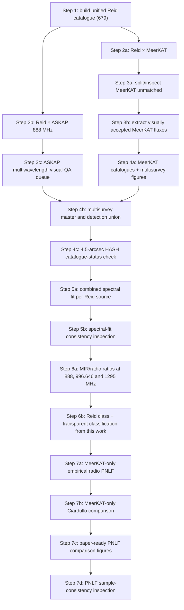

# LMC PN radio workflow and method decisions

Last updated: 12 August 2026

## Current numbered workflow



## Project structure and reproducible run

- `00_Context`: paper context, literature/background material, the optical-PNLF
  work, dated pre-rebuild archive, technical history, and pipeline logs.
- `01_Data`: source survey data. The active ASKAP catalogue is only
  `ASKAP_LMC_888MHz_catalogue_full.vot`; the earlier smaller subset is archived
  under `00_Context/Archive_PreRebuild_2026-08-10/Obsolete_Data`. The frozen
  HASH inputs are `HASH_V163_full.vot` and `HASH_V163_ReadMe.txt` from the
  official CDS/VizieR V/163 release.
- `02_Scripts`: the active numbered workflow. Inspection scripts are under
  `02_Scripts/Inspect`; superseded scripts are under `Legacy` folders and are
  not run.
- `03_Outputs`: current generated catalogues only, all in VOTable format.
- `04_Figures`: current generated figures only, all in PDF format. Source-level
  and QA material is under `04_Figures/Inspect`.

Run the complete workflow with:

```bash
/opt/homebrew/Caskroom/miniforge/base/envs/python-data-app/bin/python \
  02_Scripts/step00_run_pipeline.py
```

The runner executes Steps 00a through 07d in dependency order, stops on the
first failure, checks the principal product of each step, and records both a
timestamped log and `pipeline_latest.log` in `00_Context/Logs`. Optional
arguments are `--from-step`, `--to-step`, `--skip-inspection`, and `--dry-run`.

## ASKAP data and cross-match

- Image: `01_Data/ASKAP_LMC_888MHz_image.fits`.
- Full catalogue: `01_Data/ASKAP_LMC_888MHz_catalogue_full.vot`.
- The catalogue contains 54,612 sources and includes Gold, Silver and Bronze lists.
- Frequency: 888 MHz.
- Reid–ASKAP accepted radius: 4.5 arcsec. Candidates at 4.5–6 arcsec and 6–10 arcsec remain in a separate review table rather than being accepted automatically.
- ASKAP integrated-flux total uncertainty combines the catalogue fitting error and the published 8 per cent absolute flux-scale term in quadrature.
- Present result: 61 accepted ASKAP associations; 56 also have MeerKAT detections and 5 are ASKAP-only. The full radio-detected union is 225 sources (220 MeerKAT and/or visual detections plus 5 ASKAP-only detections).
- Step 3c supplies four-panel ASKAP/H-alpha/[O III]/8-micron inspection pages for all 61 accepted associations and the 3 borderline/wide candidates. It also creates a 64-row VOTable queue with blank `manual_decision` and `manual_notes` fields; no decision is changed automatically.
- Both Step 04a sky maps derive the survey boundaries directly from the finite
  data masks in `LMC_I_mosaic_ch0_beam.fits` and
  `ASKAP_LMC_888MHz_image.fits`. Contours of the sampled masks preserve the
  actual MeerKAT and ASKAP mosaic shapes while excluding padded blank pixels.
  Both outlines and source positions are reprojected onto one common
  LMC-centred ICRS SIN grid; consequently, their combined-map geometry need not
  look identical to two separate native-image panels in CARTA. The map limits
  are set from the combined reprojected extent so neither footprint is clipped.
  A direct unsampled-mask check gives 656/679 Reid positions inside MeerKAT
  (23 outside, exactly matching Step 03a) and 674/679 inside ASKAP. The first
  map shows the 454 Reid candidates detected by neither survey and uses
  distinct symbols for the three radio-detected subsets. The second map shows
  all 679 sources by their original Reid optical class (True, Known, Likely,
  Possible, or Unknown) while keeping the same two survey footprints. Small
  filled shapes encode Reid class; coloured outline rings independently mark
  MeerKAT-only, MeerKAT+ASKAP, and ASKAP-only detections. Undetected sources
  are deliberately faded so the 225 radio detections remain legible. The
  companion Step 04a multisurvey detection-summary figure splits
  its cards into two labelled rows: overlapping survey counts (220 MeerKAT,
  61 ASKAP, and the 225-source union) and mutually exclusive groups (164
  MeerKAT-only, 56 common, and 5 ASKAP-only). This prevents the overlapping
  totals from being mistaken for quantities that should be added together.
  Its class bars explicitly report detected/total counts: True 40/311, Known
  172/275, Likely 1/40, Possible 7/47, and Unknown 0/6.

## HASH catalogue-status check

Step 04c uses the official public HASH catalogue release at CDS/VizieR,
`V/163/pnmain`. The archived input contains 11,760 database entries; the
cross-match is restricted locally to the 845 rows whose HASH `Domain` is
`LMC`. This frozen release was retrieved on 12 August 2026 and is preferable
to an undocumented live-interface export because its table version, fields and
provenance can be reproduced.

The 225-source MeerKAT-or-ASKAP detection union is matched to the HASH LMC
table using a strict 4.5-arcsec angular radius. Candidate pairs are sorted by
separation and accepted closest-first with unique Reid and HASH indices, making
the result explicitly one-to-one. The output retains candidate counts and an
ambiguity flag; the present match contains no ambiguous or duplicated pairs.
The median accepted separation is 0.009 arcsec and the maximum is 2.312
arcsec. A reproducible 1,000-trial local-shift test (random 60--300 arcsec
offsets) gives 0.033 accidental matches per trial; this diagnostic does not
change the 4.5-arcsec acceptance rule.

Current result:

- 208/225 radio-detected Reid sources are listed in HASH within 4.5 arcsec;
- 200 have HASH `PNstat = T` and are reported as "listed as True in HASH";
- 8 have `PNstat = P` and remain HASH Possible PNe rather than being called
  confirmed;
- 17 have no HASH LMC entry within 4.5 arcsec.

The principal all-source catalogue is
`03_Outputs/step04c_hash_status_all.vot`; matched and unmatched subsets are
also written separately. HASH identifiers, position, separation, offsets,
status, domain, source catalogue, SIMBAD identifier, morphology and angular
diameters are carried into Steps 05--06. For 206/208 matches the HASH origin
catalogue is the legacy Reid & Parker 2010 reference
`2010MNRAS.tmp..716R`, and 207/208 positions use that reference. HASH is
therefore a useful catalogue-status check but **not an independent layer of
confirmation**, **not** a positive evidence unit, and does not alter
`our_classification`. We report what HASH currently lists while keeping the
radio/MIR evidence grade developed in this work methodologically separate.

The paper should cite Parker, Bojičić & Frew (2016) and include the HASH
requested acknowledgement: "This research has made use of the HASH PN
database at hashpn.space".

## Spectral-index decision

For each Reid source, fit

`log10(S_nu) = alpha log10(nu) + intercept`

using every valid independent frequency measurement:

- up to 12 MeerKAT subchannels from 908.037 to 1656.2 MHz (channels 8 and 9 are omitted because of RFI);
- one ASKAP integrated-flux measurement at 888 MHz when available.

The MeerKAT 1.295-GHz broadband point is plotted as an open blue reference marker but is not fitted, because it is derived from the same data as the subchannels and would otherwise double-count the MeerKAT band. MeerKAT subchannels are blue; ASKAP is orange.

Classification is applied only after the fit passes the quality cuts (at least
four usable measurements, alpha error < 0.5 and reduced chi-square < 10):

- `thermal`: -0.2 <= alpha <= +2.0;
- `uncertain`: -0.5 <= alpha < -0.2 (the physical intermediate interval);
- `steep`: alpha < -0.5;
- `no_reliable_alpha`: no fit, insufficient measurements, failed quality cut,
  or alpha above the physical free-free range.

The `no_reliable_alpha` status is not one of the three physical spectral
classes and is not mixed into the uncertain/intermediate histogram.

Current combined MeerKAT+ASKAP result: 98 reliable fits, comprising 31 thermal,
31 uncertain/intermediate and 36 steep sources. A further 127 sources have
`no_reliable_alpha`. A measurable slope exists for 149 of the 225 radio-detected
Reid sources, but 51 of those fitted slopes fail the reliability cuts. Every
source retains an SED inspection page.

## Cohen MIR/radio frequency decision

Cohen et al. (2011) did **not** define the diagnostic at 1.2 GHz. They used MGPS-2 at 843 MHz and NVSS at 1.4 GHz, explicitly treating the two surveys as if they measured a common frequency near 1 GHz. Their full-PN-sample median 8-micron/radio ratio is 4.7 +/- 1.1.

This project therefore stores three measured ratios separately:

- `cohen_ratio_askap_888`;
- `cohen_ratio_mkt_996p646` (MeerKAT channel 4, the actual subchannel closest to 1 GHz);
- `cohen_ratio_mkt_1295` (MeerKAT broadband central frequency).

The adopted `cohen_ratio_near1GHz` selects 996.646 MHz first, ASKAP 888 MHz second, and 1295 MHz only as a fallback. It does not silently rescale fluxes.

Current medians are 6.02 (ASKAP 888 MHz, N=51), 4.14 (MeerKAT 996.646 MHz, N=101), 5.89 (MeerKAT 1295 MHz, N=156), and 5.98 for the adopted near-1-GHz ratio (N=157).

Important limitation: Cohen et al. used integrated nebular IRAC fluxes. The present SAGE input is catalogue photometry, so the MIR/radio result is a screening diagnostic until aperture photometry/background subtraction is validated on the images. It is not allowed to reject a candidate on its own.

## Confidence/classification method

The output deliberately keeps two separate columns:

- `reid_classification`: Reid & Parker's Known/True/Likely/Possible class, unchanged;
- `our_classification`: High-confidence PN, Probable PN, Possible PN, or Questionable/review.

This is an ordinal evidence grade, not a numerical posterior probability.

One positive evidence unit is assigned for each of:

1. secure MeerKAT catalogue association;
2. independent confirmation in both MeerKAT and ASKAP;
3. reliable thermal-like spectrum (-0.2 <= alpha <= +2.0);
4. MIR/radio screening ratio between 0.5 and 10.

Base rules:

- High-confidence PN: Reid Known/True and at least three positive units;
- Probable PN: Reid Known/True and at least one unit, Reid Likely and at least two, or Reid Possible and at least three;
- Possible PN: remaining cases.

Caution rules:

- one reliable steep spectrum or one extreme MIR/radio diagnostic caps the result at Possible PN and sets the review flag;
- ASKAP-only detection, ASKAP Bronze/component status, or two independent contradictory diagnostics gives Questionable/review.

The catalogue also stores the positive/conflict counts, association evidence,
spectral evidence, MIR evidence, review flag and a source-by-source text
explanation. HASH T/P/no-match fields are retained in the same rows as a
catalogue-status check but are not scored. The enlarged Step 00a methodology
figure now carries the radio-detected union through the HASH check, these evidence inputs,
thresholds and caution rules, and the final 225-source radio PN candidate list.
After applying the corrected spectral intervals, current totals are 28
High-confidence, 90 Probable, 97 Possible and 10 Questionable/review.

## PNLF decision

The primary radio PNLF remains MeerKAT-only at 1.295 GHz. The five ASKAP-only objects stay in the master catalogue but are explicitly excluded from the PNLF fit. Mixing their 888-MHz fluxes directly with 1.295-GHz MeerKAT fluxes would combine different frequencies, beams, sensitivities and completeness functions. ASKAP can later be analysed as a separate comparison sample, but it should not be inserted into the MeerKAT PNLF bins without its own completeness model and a documented frequency conversion.

Reproducibility note: Step 07c currently re-fits the PNLF models to create the
compact paper figures rather than reading a saved model-results table from Step
07a. The preferred model is unchanged (canonical Ciardullo), but a few
non-leading optimisation metrics differ slightly between the two scripts. No
backend fit was changed during this rebuild. Before finalising the paper's
model-comparison table, Step 07a should export one authoritative fit-results
VOTable and Step 07c should plot those stored results.

## Literature links

- Cohen et al. (2011): https://academic.oup.com/mnras/article/413/1/514/1063519
- Pennock et al. (2021): https://academic.oup.com/mnras/article/506/3/3540/6313301
- ASKAP catalogue metadata: https://cdsarc.cds.unistra.fr/viz-bin/ReadMe/J/MNRAS/506/3540?format=html&tex=true
- Reid & Parker (2006): https://academic.oup.com/mnras/article/373/2/521/1273715
- HASH catalogue V/163: https://cdsarc.cds.unistra.fr/viz-bin/w/VizieR-3?-source=V%2F163
- Parker, Bojičić & Frew (2016): https://ui.adsabs.harvard.edu/abs/2016JPhCS.728c2008P/abstract
